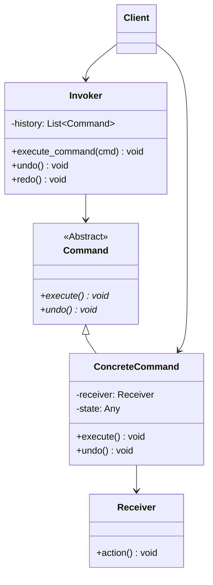
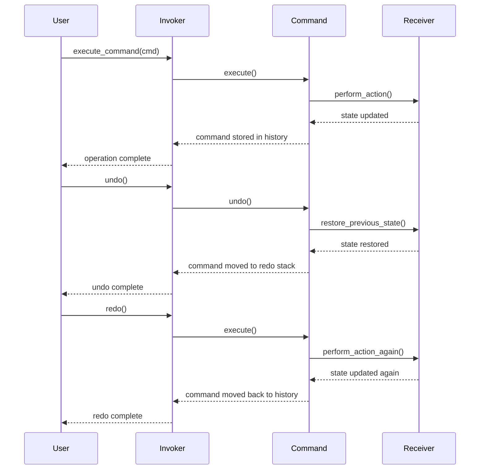

# Command Pattern (Behavioral)

> **Architectural Level:** Object Behavior  
> **Pythonic Strategy:** First-Class Functions & Objects as Commands  
> **Production Status:** Thread-Safe | Undo/Redo Ready | Extensively Documented

## Also Known As

- Action
- Transaction

## Intent

Encapsulate a request as an object, thereby allowing you to parameterize clients with different requests, queue requests, log requests, and support undoable operations. The Command pattern is a behavioral design pattern that turns a request into a stand-alone object that can be passed around, stored, executed later, and undone.

## Problem

In many applications, you need to perform operations that must be:

- **Queued for Later Execution:** The requester and performer of a request are decoupled in space (async operations) or time (delayed execution).
- **Reversible (Undo/Redo):** Users expect to undo their actions and redo them—but undo logic is scattered throughout your code.
- **Logged or Audited:** You need to record what operations happened, when they happened, and potentially replay them.
- **Rolled Back:** Transactions must be supported where multiple operations either all succeed or all fail.
- **Parameterized:** Client code shouldn't know about specific operation types; it should treat all operations uniformly.

**Real-World Scenario:**

A text editor needs undo/redo functionality:

```python
# Anti-pattern: Undo logic scattered across the code
class TextEditor:
    def __init__(self):
        self.text = ""
        self.undo_stack = []
    
    def insert_text(self, position, text):
        self.undo_stack.append(("insert", position, text))  # Ad-hoc undo
        self.text = self.text[:position] + text + self.text[position:]
    
    def delete_text(self, position, length):
        self.undo_stack.append(("delete", position, length))  # Different format
        self.text = self.text[:position] + self.text[position + length:]
    
    def undo(self):
        if not self.undo_stack:
            return
        action_type, *args = self.undo_stack.pop()
        if action_type == "insert":
            # Complex undo logic for insert
            pass
        elif action_type == "delete":
            # Different complex undo logic for delete
            pass
        # Hard to maintain; fragile
```

With the Command pattern, each operation is encapsulated as an object that knows how to undo itself:

```python
# Clean: Unified command interface
class InsertCommand:
    def __init__(self, editor, position, text):
        self.editor = editor
        self.position = position
        self.text = text
        self.previous_state = None
    
    def execute(self):
        self.previous_state = self.editor.get_text()
        self.editor.insert_text(self.position, self.text)
    
    def undo(self):
        self.editor.text = self.previous_state
```

## Solution

Create an abstract `Command` interface that all concrete commands implement. Each command encapsulates:
1. **A receiver object** that performs the actual work
2. **The parameters** needed for the operation
3. **Execution logic** (execute method)
4. **Reversal logic** (undo method, optional but recommended)

The `Invoker` decouples the requester from the performer by executing commands without knowing their concrete types. It maintains a history for undo/redo support.

### How It Works

1. **Command Interface:** Declares `execute()` method (and optionally `undo()`).
2. **Concrete Commands:** Implement the command for specific operations.
3. **Receiver:** Contains the actual business logic and state.
4. **Invoker:** Executes commands and maintains history.
5. **Client:** Creates command objects and passes them to the invoker.

### Architectural Workflow



### Sequence: Undo/Redo Workflow



## Real-World Example

**Text Editor with Full Undo/Redo History:**

A professional text editor (like VSCode, Sublime Text) uses the Command pattern to manage:
- Undo/redo stacks with no special-casing
- Multiple types of operations (insert, delete, format, find-replace) with uniform interface
- Multi-level undo where 50+ operations can be undone sequentially
- Macro operations (multiple commands executed as one)

```python
editor = TextEditor("Hello")
invoker = Invoker(max_history=100)

# User performs edits
insert_cmd = InsertTextCommand(editor, 5, " World")
invoker.execute_command(insert_cmd)  # "Hello World"

delete_cmd = DeleteTextCommand(editor, 0, 6)
invoker.execute_command(delete_cmd)  # "World"

# User realizes mistake
invoker.undo()  # Back to "Hello World"
invoker.undo()  # Back to "Hello"

# User changes mind
invoker.redo()  # Forward to "Hello World"
```

## Key Characteristics

### Advantages

- **Decoupling:** Separates the object that invokes an operation from the one that performs it.
- **Queuing & Scheduling:** Commands can be queued, scheduled, or executed asynchronously.
- **Undo/Redo:** Each command knows how to reverse itself; history management is uniform.
- **Logging & Auditing:** Record which commands were executed and in what order.
- **Macro Commands:** Compose simple commands into complex operations executed atomically.
- **Deferred Execution:** Request execution can be delayed or conditionally executed.
- **Command History:** Build rich audit trails and replay functionality.

### Disadvantages

- **Class Proliferation:** Many command classes can clutter the design space.
- **Overhead:** Creating command objects adds memory overhead for simple operations.
- **Complexity:** Overkill for simple, straightforward operations.
- **State Management:** Undo/redo requires careful state capture and restoration.

## Patterns Comparison

### Command vs. Strategy

| Aspect | Command | Strategy |
|--------|---------|----------|
| **Purpose** | Encapsulate a request for later execution | Encapsulate an algorithm to be used |
| **Execution** | Typically executed after creation | Used immediately as an alternative |
| **History** | Often maintains history for undo | No history management |
| **Use When** | Need undo/redo or queuing | Need interchangeable algorithms |

### Command vs. Observer

| Aspect | Command | Observer |
|--------|---------|----------|
| **Direction** | One object requests action from another | One object notifies many others |
| **Coupling** | Decouples sender from receiver | Decouples subject from observers |
| **Use When** | Need to encapsulate requests | Need pub/sub notification |

### Command vs. Memento

| Aspect | Command | Memento |
|--------|---------|---------|
| **Focus** | Encapsulates an action/request | Captures object state for restoration |
| **Undo** | Command knows how to undo itself | Memento stores state snapshot |
| **Use When** | Need reversible operations | Need state snapshots/rollback |

## Implementation Patterns

### Pattern 1: Basic Command with Receiver (Recommended)

```python
from abc import ABC, abstractmethod

class Command(ABC):
    @abstractmethod
    def execute(self) -> None:
        pass
    
    @abstractmethod
    def undo(self) -> None:
        pass

class Receiver:
    def __init__(self):
        self.state = ""
    
    def perform_action(self):
        # Actual work
        pass

class ConcreteCommand(Command):
    def __init__(self, receiver: Receiver, arg: Any):
        self.receiver = receiver
        self.arg = arg
        self.previous_state = None
    
    def execute(self):
        self.previous_state = self.receiver.state
        self.receiver.perform_action(self.arg)
    
    def undo(self):
        self.receiver.state = self.previous_state
```

### Pattern 2: Invoker with History Management (Recommended)

```python
class Invoker:
    def __init__(self, max_history: int = 100):
        self.history: List[Command] = []
        self.redo_stack: List[Command] = []
        self.max_history = max_history
    
    def execute_command(self, command: Command) -> None:
        command.execute()
        self.history.append(command)
        self.redo_stack.clear()
        
        if len(self.history) > self.max_history:
            self.history.pop(0)
    
    def undo(self) -> bool:
        if not self.history:
            return False
        cmd = self.history.pop()
        cmd.undo()
        self.redo_stack.append(cmd)
        return True
    
    def redo(self) -> bool:
        if not self.redo_stack:
            return False
        cmd = self.redo_stack.pop()
        cmd.execute()
        self.history.append(cmd)
        return True
```

### Pattern 3: Macro Commands for Composite Operations

```python
class MacroCommand(Command):
    def __init__(self, commands: List[Command] = None):
        self.commands = commands or []
    
    def add_command(self, cmd: Command) -> None:
        self.commands.append(cmd)
    
    def execute(self) -> None:
        for cmd in self.commands:
            cmd.execute()
    
    def undo(self) -> None:
        for cmd in reversed(self.commands):
            cmd.undo()

# Usage:
macro = MacroCommand()
macro.add_command(InsertTextCommand(editor, 0, "Hello"))
macro.add_command(InsertTextCommand(editor, 5, " World"))
invoker.execute_command(macro)  # Both commands executed as one
invoker.undo()  # Both commands undone as one
```

### Pattern 4: Async Command Execution

```python
import asyncio

class AsyncCommand(Command):
    async def execute_async(self) -> None:
        await self.receiver.perform_async_action(self.arg)
    
    def execute(self) -> None:
        asyncio.run(self.execute_async())

# Usage in event loop:
class AsyncInvoker:
    async def execute_async(self, cmd: AsyncCommand) -> None:
        await cmd.execute_async()
        self.history.append(cmd)
```

## Usage Guidelines

### When to Use

- Your application must support reversible operations (undo/redo).
- You need to queue, log, or schedule operations.
- You want to parameterize objects with operations.
- You need to support macro operations (composing multiple commands).
- You require audit trails or transaction support.
- Different clients need different operations, and you want a uniform interface.

### When NOT to Use

- Simple, one-time operations with no undo requirement.
- Performance-critical inner loops where command object overhead is unacceptable.
- Very few operation types (might be simpler to hardcode).
- No need for queuing, logging, or delayed execution.

## Best Practices

1. **Implement Both `execute()` and `undo()`:** Make reversibility a first-class concern.

2. **Capture State Before Execution:** Store previous state for reliable undo.

3. **Use the Invoker Pattern:** Never manage history manually; use a dedicated invoker.

4. **Composite Commands:** Use `MacroCommand` to treat multiple operations as one.

5. **Named Commands:** Each command class should have a descriptive name.

6. **Type-Safe Receivers:** Commands should work with typed receivers, not dynamic dispatch.

7. **Clear Ownership:** Make it explicit which command owns which receiver.

8. **Limit History Size:** Prevent unbounded memory growth with `max_history`.

```python
# Good: Clear, reversible, typed
class RenameFileCommand(Command):
    def __init__(self, file_manager: FileManager, old_name: str, new_name: str):
        self.file_manager = file_manager
        self.old_name = old_name
        self.new_name = new_name
    
    def execute(self) -> None:
        self.file_manager.rename(self.old_name, self.new_name)
    
    def undo(self) -> None:
        self.file_manager.rename(self.new_name, self.old_name)
```

## Real-World Applications

- **Text Editors:** Undo/redo functionality (VSCode, Sublime Text, Vim)
- **Photo Editors:** Non-destructive editing with full history (Photoshop, GIMP)
- **Version Control Systems:** Commits as commands with revert capability (Git)
- **Database Transactions:** Commands as database operations with rollback support
- **GUI Frameworks:** Event handlers, button clicks, menu actions
- **Macro Recording:** Recording and replaying sequences of operations
- **Job Queues:** Async job processing with retry and dead-letter handling
- **Network Protocols:** Serializable commands sent over the wire

## See Also

- [Command Pattern - Wikipedia](https://en.wikipedia.org/wiki/Command_pattern)
- [Memento Pattern - Wikipedia](https://en.wikipedia.org/wiki/Memento_pattern)
- [Observer Pattern - Wikipedia](https://en.wikipedia.org/wiki/Observer_pattern)
- [Strategy Pattern - Wikipedia](https://en.wikipedia.org/wiki/Strategy_pattern)
- [../memento/README.md](../memento/README.md)
- [../observer/README.md](../observer/README.md)
- [../strategy/README.md](../strategy/README.md)
