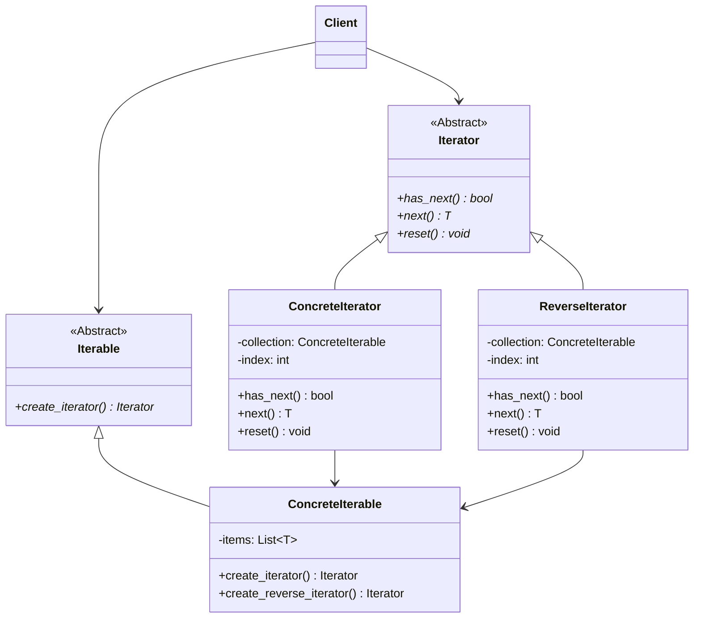
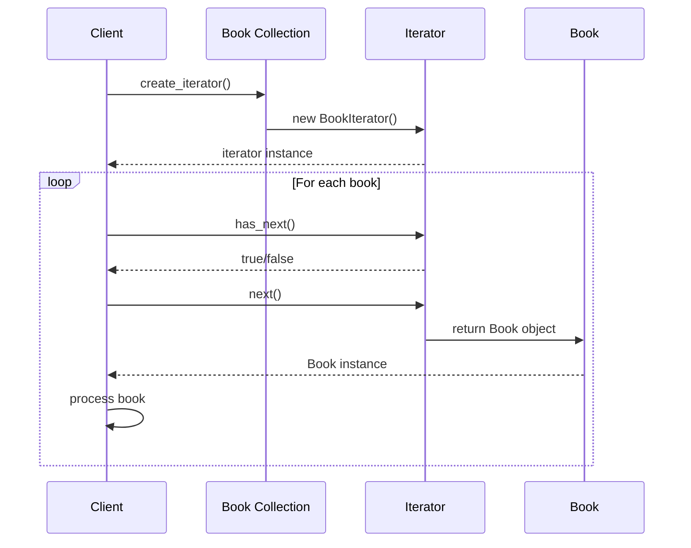

# Iterator Pattern (Behavioral)

> **Architectural Level:** Collection Traversal  
> **Pythonic Strategy:** Generators & Iterators Protocol  
> **Production Status:** Multiple Strategies | Memory Efficient | Extensively Documented

## Also Known As

- Cursor

## Intent

Provide a way to access the elements of an aggregate object sequentially without exposing its underlying representation. The Iterator pattern lets you traverse different aggregate structures in a uniform manner without coupling your code to their internal structures.

## Problem

Collections (lists, trees, graphs, etc.) have different internal structures and representations. Traversal logic often becomes tightly coupled to the specific implementation:

- **Tight Coupling:** Client code knows about the internal structure of collections (direct array access, pointer traversal).
- **Multiple Traversal Strategies:** You might need to iterate forward, backward, filtered, or in custom orders from the same collection.
- **Scattered Logic:** Traversal logic repeated in multiple places whenever iterating.
- **Complex Data Structures:** Non-linear structures (trees, graphs) are harder to traverse uniformly.
- **Memory Inefficiency:** Computing all elements upfront may be wasteful for large or infinite sequences.

**Real-World Scenario:**

A bookstore library application needs to iterate through a book collection in different ways:

```python
# Anti-pattern: Direct access to internal structure
library.books  # Direct array access
for i in range(len(library.books)):
    book = library.books[i]
    # Process book

# If we want reverse order, need completely different code
for i in range(len(library.books) - 1, -1, -1):
    book = library.books[i]
    # Process book

# If we want filtered, need even more special logic
for i in range(len(library.books)):
    if library.books[i].genre == "Science Fiction":
        # Process book
```

With the Iterator pattern:

```python
# Clean: Uniform interface for all traversal strategies
for book in library.create_iterator():
    # Process book

for book in library.create_reverse_iterator():
    # Process book in reverse

for book in library.create_filtered_iterator(genre="Science Fiction"):
    # Process only sci-fi books
```

## Solution

Introduce an `Iterator` interface that defines methods for sequential access (`has_next()`, `next()`). Each concrete iterator encapsulates a specific traversal strategy. The collection implements an `Iterable` interface that creates iterators on demand. This decouples traversal logic from the collection's internal representation.

### How It Works

1. **Iterator Interface:** Declares `has_next()` and `next()` methods.
2. **Concrete Iterators:** Implement iteration for specific strategies (forward, reverse, filtered, etc.).
3. **Iterable Interface:** Declares method to create iterators.
4. **Concrete Collection:** Implements Iterable, creates appropriate iterators.
5. **Client:** Uses the iterator to traverse without knowing collection internals.

### Architectural Workflow



### Sequence: Iterating with Multiple Strategies



## Real-World Example

**Library Book Management with Multiple Traversal Strategies:**

A bookstore needs to:
- Display all books in order
- Display books in reverse chronological order
- Find books by genre, author, or publication year
- Handle potentially large collections efficiently

```python
# Create library and add books
library = BookCollection()
library.add_book(Book("Foundation", "Asimov", 1951, 255, "Sci-Fi"))
library.add_book(Book("1984", "Orwell", 1949, 328, "Dystopian"))
# ... more books

# Multiple iteration strategies
forward_iter = library.create_iterator()
reverse_iter = library.create_reverse_iterator()
filtered_iter = library.create_filtered_iterator(genre="Sci-Fi")

# All use the same interface
while forward_iter.has_next():
    print(forward_iter.next())
```

## Key Characteristics

### Advantages

- Uniform Access: All traversals use the same iterator interface.
- Decoupling: Client code doesn't depend on collection internals.
- Multiple Traversals: Support different iteration strategies simultaneously.
- Collection Independence: Same iterator interface works with any collection type.
- Lazy Evaluation: Compute elements on-demand for memory efficiency.
- Concurrent Iteration: Multiple independent iterators on the same collection.

### Disadvantages

- Class Proliferation: Many iterator classes can clutter the design.
- Overhead: Iterator objects add memory and performance overhead.
- Complexity: Simple collections don't need this complexity.
- Abstraction: Extra layer of indirection for simple cases.

## Patterns Comparison

### Iterator vs. For-Each Loop

| Aspect | Iterator | For-Each |
|--------|----------|----------|
| **Control** | Explicit iteration control | Implicit iteration |
| **Flexibility** | Can implement any traversal | Limited to collection order |
| **State** | Iterator maintains position | Hidden state |
| **Performance** | Slightly more overhead | Native/optimized |

### Iterator vs. Generator (Python)

| Aspect | Iterator | Generator |
|--------|----------|-----------|
| **Creation** | Classes with methods | Function with yield |
| **Simplicity** | More boilerplate | More concise |
| **Memory** | Lazy execution possible | Lazy by default |
| **Pythonic** | Formal, explicit | Natural, Pythonic |

### Iterator vs. Visitor

| Aspect | Iterator | Visitor |
|--------|----------|---------|
| **Traversal** | Sequential access to elements | Operations on complex structures |
| **Structure** | Assumes simple sequence | Handles complex composite trees |
| **Use When** | Iterate through collections | Process complex object graphs |

## Implementation Patterns

### Pattern 1: Basic Iterator Interface (Recommended)

```python
from abc import ABC, abstractmethod
from typing import Generic, TypeVar, List

T = TypeVar("T")

class Iterator(ABC, Generic[T]):
    @abstractmethod
    def has_next(self) -> bool:
        pass
    
    @abstractmethod
    def next(self) -> T:
        pass
    
    @abstractmethod
    def reset(self) -> None:
        pass

class ConcreteIterator(Iterator[T]):
    def __init__(self, items: List[T]):
        self.items = items
        self.index = 0
    
    def has_next(self) -> bool:
        return self.index < len(self.items)
    
    def next(self) -> T:
        if not self.has_next():
            raise StopIteration()
        item = self.items[self.index]
        self.index += 1
        return item
    
    def reset(self) -> None:
        self.index = 0
```

### Pattern 2: Multiple Iteration Strategies (Recommended)

```python
class Collection(Iterable[T]):
    def create_iterator(self) -> Iterator[T]:
        return ConcreteIterator(self.items)
    
    def create_reverse_iterator(self) -> Iterator[T]:
        return ReverseIterator(self.items)
    
    def create_filtered_iterator(self, predicate) -> Iterator[T]:
        return FilteredIterator(self.items, predicate)
```

### Pattern 3: Pythonic Generator-Based Iterator

```python
class Iterable(ABC):
    @abstractmethod
    def __iter__(self):
        pass

class ConcreteIterable(Iterable):
    def __init__(self, items: List[T]):
        self.items = items
    
    def __iter__(self):
        for item in self.items:
            yield item  # Simple generator-based iteration
```

### Pattern 4: Lazy Iterator (Memory Efficient)

```python
class LazyIterator(Iterator[T]):
    def __init__(self, generator_func, size=None):
        self.generator_func = generator_func
        self.size = size
        self.index = 0
    
    def has_next(self) -> bool:
        if self.size is None:
            return True  # Infinite sequence
        return self.index < self.size
    
    def next(self) -> T:
        if not self.has_next():
            raise StopIteration()
        value = self.generator_func(self.index)
        self.index += 1
        return value
    
    def reset(self) -> None:
        self.index = 0

# Usage: iterate infinite Fibonacci sequence without storing all values
fib_iter = LazyIterator(lambda n: fib(n), size=None)
for _ in range(100):
    print(next(fib_iter.next()))
```

## Usage Guidelines

### When to Use

- Collection has complex internal structure that shouldn't be exposed.
- Need multiple simultaneous iterations over the same collection.
- Want to support different traversal strategies uniformly.
- Need lazy evaluation for performance or memory reasons.
- Traversal logic would otherwise be scattered across codebase.
- Want to decouple client code from collection internals.

### When NOT to Use

- Simple arrays where direct access is sufficient.
- Only one standard traversal order is ever needed.
- Collection is immutable and rarely traversed.
- Performance is critical and iterator overhead is unacceptable.
- Python's built-in iteration (generators) is sufficient.

## Best Practices

1. **Use Protocol Methods:** Implement `__iter__()` and `__next__()` for Pythonic code.

```python
class MyIterator:
    def __iter__(self):
        return self
    
    def __next__(self):
        if self.index >= len(self.items):
            raise StopIteration()
        item = self.items[self.index]
        self.index += 1
        return item
```

2. **Support Multiple Iterators:** Create different iterator types for different strategies.

3. **Reset Capability:** Allow iterators to reset to the beginning if needed.

4. **Lazy Evaluation:** Generate elements on-demand when possible.

5. **Type Safety:** Use generics to ensure type-safe iteration.

6. **Clear Documentation:** Document what each iterator does and in what order.

7. **Graceful StopIteration:** Properly raise `StopIteration` when exhausted.

## Real-World Applications

- **Collections Frameworks:** Java Collections, Python itertools, C++ STL iterators
- **Database Result Sets:** SQL query result iteration without loading all rows
- **File Systems:** Directory traversal (breadth-first, depth-first)
- **Network Streaming:** Streaming HTTP response bodies
- **Lazy Sequences:** Infinite streams, computed sequences
- **Tree/Graph Traversal:** Pre-order, in-order, post-order, breadth-first, depth-first
- **Pagination:** Fetching results page-by-page
- **Event Processing:** Message queues, event streams

## See Also

- [Iterator Pattern - Wikipedia](https://en.wikipedia.org/wiki/Iterator_pattern)
- [Python Iterators and Generators - Official Docs](https://docs.python.org/3/howto/functional.html#iterators)
- [Visitor Pattern - Wikipedia](https://en.wikipedia.org/wiki/Visitor_pattern)
- [Observer Pattern - Wikipedia](https://en.wikipedia.org/wiki/Observer_pattern)
- [../visitor/README.md](../visitor/README.md)
- [../observer/README.md](../observer/README.md)
