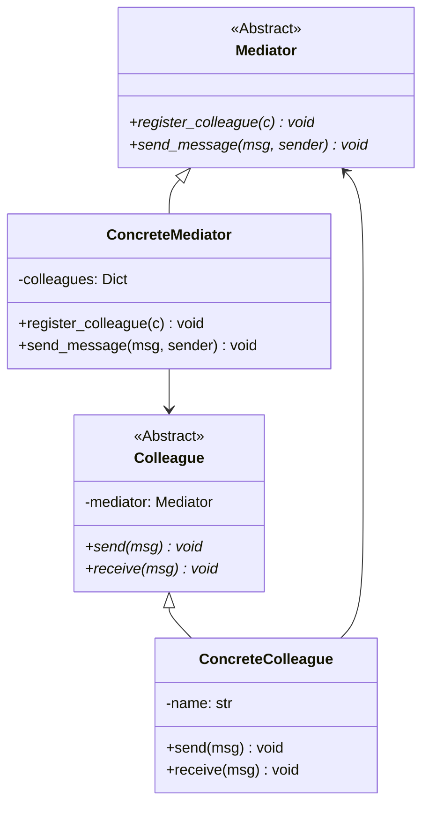
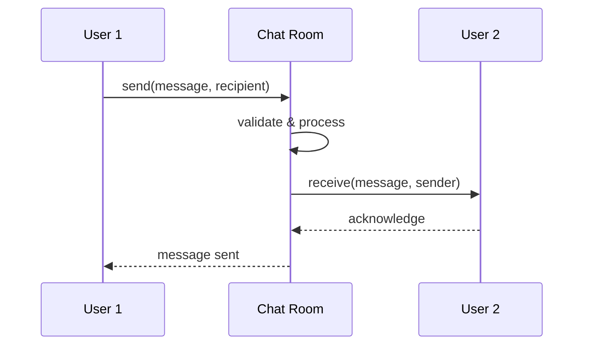

# Mediator Pattern (Behavioral)

> **Architectural Level:** Interaction Coordination  
> **Pythonic Strategy:** Centralized Object Coordination  
> **Production Status:** Decoupled Communication | Scalable | Extensively Documented

## Also Known As

- Intermediary

## Intent

Define an object that encapsulates how a set of objects interact. The Mediator pattern promotes loose coupling by keeping objects from referring to each other explicitly, and it lets you vary their interaction independently. Instead of objects communicating directly, they communicate through a central mediator.

## Problem

In many systems, objects need to communicate with each other, but direct communication creates tight coupling:

- **Hard Dependencies:** Objects hold references to each other, creating a web of dependencies.
- **Difficult to Reuse:** Objects depend on specific colleagues, making them hard to reuse in different contexts.
- **Complex Interactions:** Interaction logic scattered across multiple classes becomes hard to understand and maintain.
- **Change Propagation:** Changing one object's behavior requires modifying all its colleagues.
- **Scalability Issues:** Adding new object types requires modifying existing colleagues.

**Real-World Scenario:**

A chat room where users communicate:

```python
# Anti-pattern: Direct communication (tight coupling)
class User:
    def __init__(self, name):
        self.name = name
        self.contacts = []  # Direct references
    
    def add_contact(self, user):
        self.contacts.append(user)
    
    def send_message(self, recipient, message):
        # Find recipient among contacts
        for contact in self.contacts:
            if contact.name == recipient:
                contact.receive_message(self.name, message)

# Problem: Every user must know about every other user
alice = User("Alice")
bob = User("Bob")
charlie = User("Charlie")

alice.add_contact(bob)
alice.add_contact(charlie)
bob.add_contact(alice)
bob.add_contact(charlie)  # Explosion of dependencies!
```

With the Mediator pattern:

```python
# Clean: Centralized communication through mediator
class ChatRoom:  # Mediator
    def __init__(self):
        self.users = {}
    
    def register_user(self, user):
        self.users[user.name] = user
    
    def send_message(self, sender_name, recipient_name, message):
        # Mediate the communication
        recipient = self.users.get(recipient_name)
        if recipient:
            recipient.receive_message(sender_name, message)

# Users only know about the chat room
alice = User("Alice", chat_room)
bob = User("Bob", chat_room)
charlie = User("Charlie", chat_room)

chat_room.register_user(alice)
chat_room.register_user(bob)
chat_room.register_user(charlie)

alice.send_message("Bob", "Hello Bob")  # Goes through mediator
```

## Solution

Create a `Mediator` interface that defines how colleagues interact. Create a `ConcreteMediator` that implements the actual interaction logic. Colleagues reference the mediator but not each other, sending requests to the mediator which then coordinates responses.

### How It Works

1. **Mediator Interface:** Defines methods for registering and coordinating colleagues.
2. **ConcreteMediator:** Implements interaction logic; maintains list of colleagues.
3. **Colleague Interface:** Knows about the mediator but not other colleagues.
4. **ConcreteColleague:** Communicates exclusively through the mediator.

### Architectural Workflow



### Sequence: Communication Through Mediator



## Real-World Example

**Chat Room with Multiple Users:**

Users communicate through a central chat room that handles:
- User registration and availability
- Message routing (direct and broadcast)
- Message history and logging
- User notifications

(See the implementation for full details)

## Key Characteristics

### Advantages

- **Reduced Coupling:** Objects don't reference each other directly.
- **Centralized Control:** All interaction logic in one place (mediator).
- **Simplifies Object Classes:** Colleagues only know about the mediator.
- **Easy to Add New Colleagues:** New types don't affect existing ones.
- **Reusability:** Colleagues can be reused with different mediators.
- **Flexible Behavior:** Interaction logic can change without modifying colleagues.

### Disadvantages

- **Mediator Complexity:** The mediator can become bloated with complex logic.
- **Single Point of Failure:** If mediator fails, entire system fails.
- **Harder to Debug:** Multiple levels of indirection complicate debugging.
- **Overkill for Simple:**  Simple systems don't need this pattern.
- **Performance:** Extra layer of indirection adds slight overhead.

## Patterns Comparison

### Mediator vs. Observer

| Aspect | Mediator | Observer |
|--------|----------|----------|
| **Focus** | Coordinated interaction | One-to-many notification |
| **Direction** | Bidirectional | One-way |
| **Coupling** | Colleagues → Mediator | Subject → Observers |
| **Use When** | Complex interactions | Simple notifications |

### Mediator vs. Facade

| Aspect | Mediator | Facade |
|--------|----------|--------|
| **Purpose** | Coordinate peer objects | Simplify complex subsystem |
| **Participants** | Equals | Provider & Clients |
| **Traffic** | Bidirectional | Unidirectional |

## Implementation Patterns

### Pattern 1: Basic Mediator (Recommended)

```python
from abc import ABC, abstractmethod

class Mediator(ABC):
    @abstractmethod
    def register_colleague(self, colleague):
        pass
    
    @abstractmethod
    def send_message(self, message, sender, recipient):
        pass

class ConcreteMediator(Mediator):
    def __init__(self):
        self.colleagues = {}
    
    def register_colleague(self, colleague):
        self.colleagues[colleague.name] = colleague
    
    def send_message(self, message, sender, recipient=None):
        if recipient:
            if recipient in self.colleagues:
                self.colleagues[recipient].receive(message, sender.name)
        else:
            for colleague in self.colleagues.values():
                if colleague != sender:
                    colleague.receive(message, sender.name)

class Colleague(ABC):
    def __init__(self, name, mediator):
        self.name = name
        self.mediator = mediator
    
    @abstractmethod
    def send(self, message, recipient=None):
        pass
    
    @abstractmethod
    def receive(self, message, sender):
        pass
```

### Pattern 2: Dialog Mediator (Form Validation)

```python
class DialogMediator:
    """Mediates interaction between form fields."""
    
    def __init__(self):
        self.fields = {}
    
    def register_field(self, field):
        self.fields[field.name] = field
    
    def on_field_changed(self, field_name, value):
        # Validate based on other fields
        field = self.fields[field_name]
        
        if field_name == "email":
            if not self.is_valid_email(value):
                self.fields["error"].set_message("Invalid email")
        elif field_name == "password":
            if len(value) < 8:
                self.fields["error"].set_message("Password too short")
        
        self.update_submit_button()
    
    def update_submit_button(self):
        # Enable submit only if all fields valid
        pass
```

## Usage Guidelines

### When to Use

- Objects need complex mutual interactions.
- Changing object interactions requires modifying multiple objects.
- Set of objects communicate in well-defined but complex ways.
- Object reuse is hindered by many dependencies on other objects.
- Behavior distributed between several classes should be customizable.

### When NOT to Use

- Simple one-to-many communication (use Observer).
- Direct communication is straightforward and uncomplicated.
- Objects rarely interact.
- Performance is critical (extra indirection).
- System has only two objects (unnecessary overhead).

## Best Practices

1. **Limit Mediator Scope:** Keep mediator focused on coordination.

2. **Avoid God Mediator:** If mediator gets too large, split functionality.

3. **Type-Safe Communication:** Use typed methods, not generic message passing.

4. **Document Interaction Rules:** Clearly document how objects interact through mediator.

5. **Testability:** Make mediator mockable for testing colleagues in isolation.

6. **Logging & Monitoring:** Log all interactions for debugging and monitoring.

```python
class ObservableMediator(ConcreteMediator):
    def __init__(self):
        super().__init__()
        self.observers = []
    
    def add_observer(self, observer):
        self.observers.append(observer)
    
    def notify_observers(self, event):
        for observer in self.observers:
            observer.on_event(event)
    
    def send_message(self, message, sender, recipient=None):
        # Log and notify observers
        self.notify_observers({
            "type": "message",
            "sender": sender.name,
            "recipient": recipient,
            "message": message,
        })
        super().send_message(message, sender, recipient)
```

## Real-World Applications

- **UI Dialog Boxes:** Field validation and inter-field dependencies
- **Air Traffic Control:** Mediates communication between aircraft
- **Chat Rooms:** Central coordination of message routing
- **Game Lobbies:** Mediates player interactions
- **Team Collaboration:** Slack, Discord, email servers
- **Network Routers:** Forward packets between network nodes
- **GUI Frameworks:** Component interaction coordination
- **Event Dispatchers:** Central event handling system

## See Also

- [Mediator Pattern - Wikipedia](https://en.wikipedia.org/wiki/Mediator_pattern)
- [Observer Pattern - Wikipedia](https://en.wikipedia.org/wiki/Observer_pattern)
- [Facade Pattern - Wikipedia](https://en.wikipedia.org/wiki/Facade_pattern)
- [../observer/README.md](../observer/README.md)
- [../command/README.md](../command/README.md)
