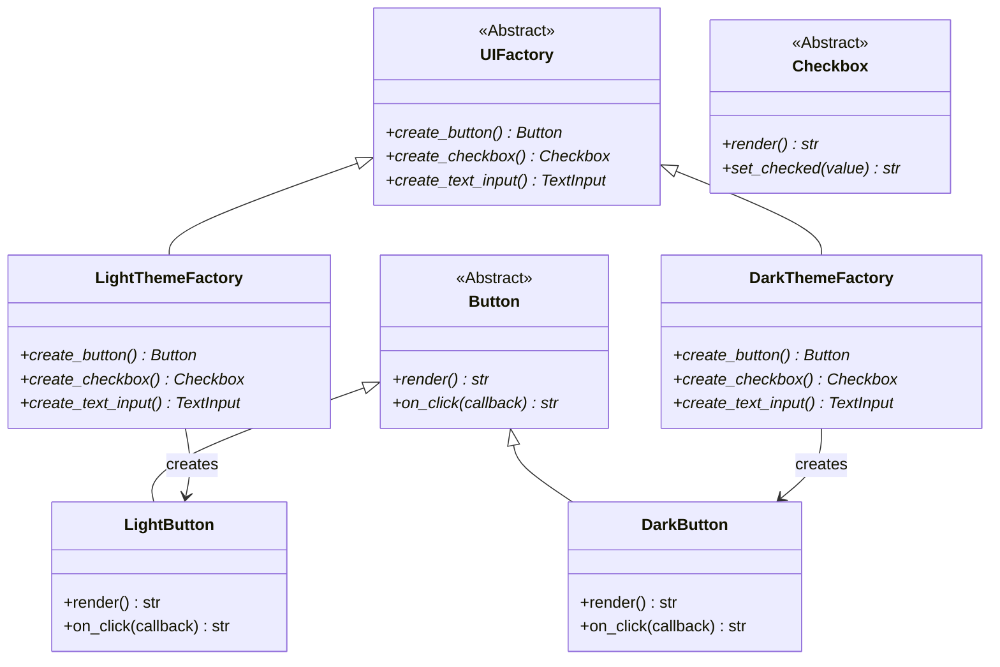
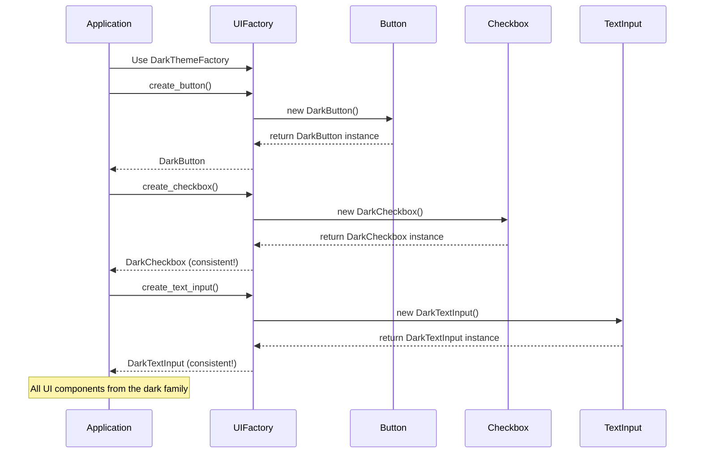

# Abstract Factory Pattern (Creational)

> **Architectural Level:** Family-Wide | **Pythonic Strategy:** Factory Polymorphism  
> **Production Status:** Encapsulated Families | Consistent Product Selections | Extensively Documented

## Also Known As

- Kit
- Product Family

## Intent

Provide an interface for creating families of related or dependent objects without specifying their concrete classes. The Abstract Factory pattern allows you to create sets of objects where members of each set are guaranteed to be compatible and consistent with one another.

## Problem

Real-world applications often need to work with related sets of objects (families/suites). For example, a GUI framework needs to support multiple themes, where each theme consists of compatible buttons, checkboxes, dialogs, etc.

**Key Issues:**

- **Incompatible Combinations:** If buttons and checkboxes are created separately from different sources, you might end up with a light theme button combined with a dark theme checkbox—visually inconsistent and unprofessional.

- **Scattered Logic:** Theme-specific creation logic spread throughout the codebase as conditional statements, making it difficult to add new themes.

- **Maintenance Nightmare:** Changing an entire theme family requires finding and modifying code in multiple locations.

- **Violation of Single Responsibility:** Client code shouldn't know about all the different themes and how to create members of each theme.

- **Testing Complexity:** Unit tests require mocking multiple related objects together, and test setup becomes complex.

**Real-World Scenario:**
Your application supports Light, Dark, and High-Contrast themes. Each theme has compatible:
- Buttons (with theme colors)
- Checkboxes (with theme styling)
- Text inputs (with theme fonts)
- Dialogs (with theme borders)

Without Abstract Factory:
```python
# Anti-pattern: Scattered theme logic
if theme == "light":
    button = LightButton()
    checkbox = LightCheckbox()
    text_input = LightTextInput()
elif theme == "dark":
    button = DarkButton()
    checkbox = DarkCheckbox()
    text_input = DarkTextInput()
# This logic gets repeated everywhere theme-specific creation happens
```

## Solution

Create an abstract factory (interface) that declares methods for creating each type of object in a family. Each concrete factory implements this interface to create a specific family of related objects.

### How It Works

1. **Abstract Products:** Define interfaces for each type of object in a family (Button, Checkbox, etc.)
2. **Product Families:** Implement concrete variants for each family (Light variants, Dark variants, etc.)
3. **Abstract Factory:** Declares methods for creating members of a product family.
4. **Concrete Factories:** Implement these methods to create specific product families.
5. **Client Code:** Works only with abstract interfaces, receiving families from factories.

### Architectural Workflow



### Sequence: Creating a Consistent UI Family



## Real-World Example

**Cross-Platform GUI Application:** An IDE needs to support Windows, macOS, and Linux native look-and-feel.

- Each platform has native button styles, scrollbars, menus
- Windows buttons look different from macOS buttons
- The user should never see mixed-platform UI elements

Without Abstract Factory:
```python
# Anti-pattern: Conditional logic for every component
if os.name == 'nt':  # Windows
    button = create_windows_button()
    scroll = create_windows_scrollbar()
    menu = create_windows_menu()
elif sys.platform == 'darwin':  # macOS
    button = create_macos_button()
    scroll = create_macos_scrollbar()
    menu = create_macos_menu()
# Repeated in 50+ places throughout the codebase
```

With Abstract Factory:
```python
#  Clean: Platform-independent code using factory
platform_factory = PlatformUIFactory.get_factory(current_platform)
button = platform_factory.create_button()  # Native to platform
scrollbar = platform_factory.create_scrollbar()  # Native to platform
```

**In This Implementation:**
- **Product Families:** Light Theme family, Dark Theme family, High Contrast family
- **Abstract Factory:** UIFactory interface
- **Concrete Factories:** LightThemeFactory, DarkThemeFactory, HighContrastThemeFactory
- **Products:** Button, Checkbox, TextInput (interfaces)
- **Concrete Products:** LightButton, LightCheckbox, LightTextInput, etc.

## Key Characteristics

### Advantages

- Consistency Guaranteed: Products from the same factory are guaranteed to be compatible.
- Single Family Creation Point: New product families require only one new factory, not modifying existing code.
- Isolation: Client code is decoupled from concrete product classes.
- Hot Swapping: Switch entire product families at runtime without changing client code.
- Open/Closed Principle: Open for extension (new themes), closed for modification.
- Easier Testing: Can mock an entire factory to test with fake products.

### Disadvantages

- Higher Complexity: More classes and interfaces introduce greater complexity than simpler patterns.
- Over-Engineering Risk: Can be overkill if there's only one or two product families.
- Extension Difficulty: Adding a new product type to existing families requires modifying all factory classes.

## Patterns Comparison

### Abstract Factory vs. Factory Method

| Aspect | Abstract Factory | Factory Method |
|--------|------------------|----------------|
| **Scope** | Creates multiple families of products | Creates a single family of products |
| **Relationships** | Products are members of coordinated families | No inherent coordination needed |
| **Extensibility** | Adding product type affects all factories | Adding product type affects one factory |
| **Use When** | Multiple related product families exist | Single product type with variants |

### Abstract Factory vs. Builder

| Aspect | Abstract Factory | Builder |
|--------|-----------------|---------|
| **Focus** | Selecting which family to create | Constructing complex objects step-by-step |
| **Complexity** | Low complexity, high consistency | High complexity but flexible assembly |
| **Product Type** | Simple objects from a family | Single complex object with variations |

## Implementation Patterns

### Pattern 1: Basic Abstract Factory (Recommended)

```python
from abc import ABC, abstractmethod

# Abstract Products
class Button(ABC):
    @abstractmethod
    def render(self) -> str:
        pass

# Concrete Products
class WindowsButton(Button):
    def render(self) -> str:
        return "Windows Style Button"

class MacButton(Button):
    def render(self) -> str:
        return "Mac Style Button"

# Abstract Factory
class GUIFactory(ABC):
    @abstractmethod
    def create_button(self) -> Button:
        pass

# Concrete Factories
class WindowsFactory(GUIFactory):
    def create_button(self) -> Button:
        return WindowsButton()

class MacFactory(GUIFactory):
    def create_button(self) -> Button:
        return MacButton()
```

### Pattern 2: Registry-Based Selection (Recommended for Many Families)

```python
from enum import Enum
from typing import Dict, Type

class Platform(Enum):
    WINDOWS = "windows"
    MAC = "mac"
    LINUX = "linux"

class GUIFactoryRegistry:
    _factories: Dict[Platform, Type[GUIFactory]] = {
        Platform.WINDOWS: WindowsFactory,
        Platform.MAC: MacFactory,
        Platform.LINUX: LinuxFactory,
    }
    
    @classmethod
    def get_factory(cls, platform: Platform) -> GUIFactory:
        factory_class = cls._factories[platform]
        return factory_class()
    
    @classmethod
    def register(cls, platform: Platform, factory_class: Type[GUIFactory]):
        cls._factories[platform] = factory_class
```

### Pattern 3: Application Context (Recommended for Complex Apps)

```python
class Application:
    def __init__(self, factory: GUIFactory):
        self._factory = factory
    
    def create_ui(self):
        button = self._factory.create_button()
        checkbox = self._factory.create_checkbox()
        dialog = self._factory.create_dialog()
        
        return [button, checkbox, dialog]
    
    def render(self) -> str:
        components = self.create_ui()
        return '\n'.join(c.render() for c in components)

# Usage:
factory = WindowsFactory()
app = Application(factory)
ui = app.render()
```

## Usage Guidelines

### When to Use

- Your application has multiple product families that must be kept consistent.
- You want to ensure that clients use products from a single family together.
- You expect to add new product families in the future.
- You want to hide the specific classes of products from clients.
- Your system must be independent of how products are created.

### When NOT to Use

- You have only a single product family.
- Adding new product types is rare and straightforward.
- The products are simple and don't require coordinated creation.
- Your codebase is small enough that you can manage conditional creation logic centrally.

## Best Practices

1. **Use Abstract Factories with Registries:** Combine with registry pattern for easy extensibility.

2. **Minimize Factory Methods:** Factories should only declare methods for product types that truly form a family.

3. **Document Product Relationships:** Clearly document which products belong to the same family.

4. **Type Hint to Abstractions:** Always reference abstract product interfaces, never concrete types.

5. **Prefer Composition Over Inheritance:** Use composition in factories rather than deep inheritance hierarchies.

6. **Consistency Checking:** Consider adding validation to ensure coherent families are used together.

7. **Factory Singletons:** Often, factory instances themselves are singletons (one per product family).

## Real-World Applications

- **Rendering Engines:** DirectX, OpenGL, Vulkan with related GPU resources and buffers.
- **Widget Libraries:** Bootstrap, Material Design, Tailwind with coordinated components.
## See Also

- [Abstract Factory Pattern - Wikipedia](https://en.wikipedia.org/wiki/Abstract_factory_pattern)
- [Factory Method Pattern - Wikipedia](https://en.wikipedia.org/wiki/Factory_method_pattern)
- [Builder Pattern - Wikipedia](https://en.wikipedia.org/wiki/Builder_pattern)
- [Prototype Pattern - Wikipedia](https://en.wikipedia.org/wiki/Prototype_pattern)
- [Strategy Pattern - Wikipedia](https://en.wikipedia.org/wiki/Strategy_pattern)
- [../factory/README.md](../factory/README.md)
- [../builder/README.md](../builder/README.md)
- [../prototype/README.md](../prototype/README.md)
