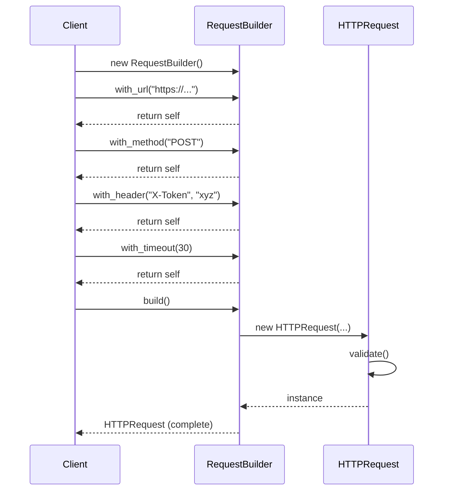
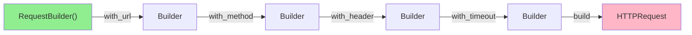

# Builder Pattern (Creational)

> **Architectural Level:** Step-by-Step Construction  
> **Pythonic Strategy:** Fluent Interface | Method Chaining  
> **Production Status:** Readable | Flexible | Fluent API

## Also Known As

- Step-by-Step Construction
- Fluent Builder

## Intent

Separate the construction of a complex object from its representation, allowing the same construction process to create different representations. The Builder pattern provides a clear, step-by-step approach to building objects with many optional parameters or complex initialization logic.

## Problem

Creating complex objects with many optional parameters leads to several issues:

- **Constructor Explosion:** Creating objects with many optional parameters leads to bloated constructors. For example, a request object with 10 optional fields would require $2^{10} = 1024$ constructor overloads!

```python
# Anti-pattern: Constructor explosion
HTTPRequest(url, method)
HTTPRequest(url, method, headers)
HTTPRequest(url, method, headers, body)
HTTPRequest(url, method, headers, body, timeout)
# ... 1020 more overload combinations ...
```

- **Readability:** When creating objects with many parameters, it's unclear what each parameter does:

```python
# Unclear: What does True mean? What order are these?
request = HTTPRequest("https://api.com", "POST", {"X-Token": "xyz"}, '{"data":"json"}', 30, 3, True, None, "token", "agent")
```

- **Partial Initialization:** You might want to set only some optional parameters, requiring multiple constructor calls or setters.

- **Immutability Issues:** If you want immutable objects (thread-safe, final), building them with setters after construction is problematic.

- **Validation Timing:** When should you validate the object? During construction or after all fields are set?

**Real-World Scenario:**
Building an HTTP request with various optional features:
- URL (required)
- Method (default: GET)
- Headers (optional)
- Query parameters (optional)
- Body (optional for POST/PUT/PATCH)
- Timeout (optional)
- Retries (optional)
- SSL verification (optional)
- Proxy (optional)
- Authentication token (optional)

Without Builder:
```python
# Nightmare: What is each parameter?
request = HTTPRequest(
    "https://api.example.com/users",
    "POST",
    {"Authorization": "Bearer token", "Content-Type": "application/json"},
    {"page": "1"},
    '{"name":"John"}',
    30,
    3,
    True,
    None,
    "token",
    "Agent"
)
```

## Solution

Create a builder class that accepts configuration methods and provides a fluent interface (method chaining). The builder accumulates the configuration and then constructs the final object when `build()` is called.

### How It Works

1. **Complex Product:** The final object being constructed.
2. **Builder:** A class with methods for setting each component/property.
3. **Fluent Interface:** Each method returns `self`, allowing method chaining.
4. **Construction:** The `build()` method creates the final object, optionally validating it.

### Key Benefits

- **Readability:** Configuration is self-documenting
- **Flexibility:** Set only the fields you need
- **Maintainability:** Adding new fields only requires a new builder method
- **Immutability:** Build immutable objects without complex constructors
- **Reusability:** Builders can be reused or reset for multiple objects

### Architectural Workflow



### Fluent Interface Example



## Real-World Example

**Configuration Management:** Building an application configuration object with many optional settings:

```python
config = ConfigBuilder()
    .with_database_host("db.example.com")
    .with_database_port(5432)
    .with_connection_pool_size(10)
    .with_log_level("INFO")
    .with_feature_flag("ai_enabled", True)
    .with_cache_ttl(3600)
    .build()
```

**Compare without Builder:**
```python
# Unclear
config = AppConfig(
    "db.example.com",
    5432,
    10,
    "INFO",
    True,
    3600,
    True,
    False,
    "us-east-1",
    # ... more parameters
)
```

**In This Implementation:**
- **HTTP Request Builder:** Constructs complex HTTP requests with various options
- **Computer Builder:** Builds computer configurations for different use cases
- **Request Templates:** Pre-built configurations using directors

## Key Characteristics

### Advantages

**Improved Readability:** Configuration is self-explanatory through method names.

**Flexibility:** Set only the parameters you need; others get sensible defaults.

**Maintainability:** Adding new optional parameters only requires a new builder method.

**Single Responsibility:** Construction logic is isolated from the product class.

**Immutability:** Create immutable objects after construction via the builder.

**Validation:** Centralize validation in the `build()` method.

**Reusability:** Builders can create multiple objects with different configurations.

### Disadvantages

**Boilerplate:** Builder classes add additional code compared to constructors.

**Complexity:** For simple objects with few parameters, builder is overkill.

**Performance:** Constructing the builder before creating the object has minimal overhead but adds steps.

## Patterns Comparison

### Builder vs. Constructor

| Aspect | Builder | Constructor |
|--------|---------|-------------|
| **Parameter Count** | No limit; methods for each parameter | Limited (constructor overload nightmare) |
| **Readability** | Excellent; method names are clear | Poor; parameter order confusing |
| **Optional Parameters** | Easy; use only needed methods | Difficult; multiple overloads needed |
| **Call Syntax** | Fluent chaining (.with_x().with_y()) | Single call with many args |

### Builder vs. Setters

| Aspect | Builder | Setters |
|--------|---------|---------|
| **Immutability** | Supports immutability | Requires mutable objects |
| **Validation Timing** | After build() called | Per each setter call (partial state) |
| **Readability** | Excellent fluent chains | Okay, but multiple statements |
| **Thread Safety** | Object immutable after build | Requires synchronization if mutable |

### Builder vs. Factory Method

| Aspect | Builder | Factory Method |
|--------|---------|----------------|
| **Complexity** | Handles multi-step construction | Handles single object creation |
| **Parameter Count** | Many optional parameters | Few fixed parameters |
| **Customization** | Fine-grained step control | Limited, creates predefined types |
| **Use When** | Complex object with many options | Simple object creation with variants |

## Implementation Patterns

### Pattern 1: Classic Fluent Builder (Recommended)

```python
class RequestBuilder:
    def __init__(self):
        self._url = ""
        self._method = "GET"
        self._headers = {}
    
    def with_url(self, url: str) -> 'RequestBuilder':
        self._url = url
        return self
    
    def with_method(self, method: str) -> 'RequestBuilder':
        self._method = method
        return self
    
    def with_header(self, key: str, value: str) -> 'RequestBuilder':
        self._headers[key] = value
        return self
    
    def build(self) -> HTTPRequest:
        request = HTTPRequest(self._url, self._method, self._headers)
        request.validate()
        return request

# Usage:
request = (RequestBuilder()
    .with_url("https://...")
    .with_method("POST")
    .with_header("X-Token", "secret")
    .build())
```

### Pattern 2: Builder with Reset (For Reusable Builders)

```python
class RequestBuilder:
    def __init__(self):
        self.reset()
    
    def reset(self) -> 'RequestBuilder':
        self._url = ""
        self._method = "GET"
        self._headers = {}
        return self
    
    def with_url(self, url: str) -> 'RequestBuilder':
        self._url = url
        return self
    
    # ... other methods ...
    
    def build(self) -> HTTPRequest:
        request = HTTPRequest(self._url, self._method, self._headers)
        self.reset()  # Automatically reset for next request
        return request

# Usage: reuse the same builder
builder = RequestBuilder()
request1 = builder.with_url("https://api1.com").build()
request2 = builder.with_url("https://api2.com").build()  # Reuse builder
```

### Pattern 3: Builder with Director (For Common Patterns)

```python
class RequestTemplates:
    """Director: provides standard configurations"""
    
    @staticmethod
    def api_request() -> HTTPRequest:
        return (RequestBuilder()
            .with_url("https://api.example.com")
            .with_header("Accept", "application/json")
            .with_timeout(15)
            .build())
    
    @staticmethod
    def webhook_request() -> HTTPRequest:
        return (RequestBuilder()
            .with_url("https://webhook.example.com")
            .with_method("POST")
            .with_max_retries(5)
            .build())

# Usage: clear intent for standard patterns
request = RequestTemplates.api_request()
```

## Usage Guidelines

### When to Use

Your object has many optional parameters (more than 3-4).

You want a readable, self-documenting API for object creation.

You want to create immutable objects.

The construction process has multiple steps or complex logic.

You want to support different representations of the same data.

You expect the set of parameters to grow over time.

### When NOT to Use

Your object has only 1-2 parameters.

All parameters are required (just use a constructor).

Performance-critical code where object creation is in a tight loop.

Your codebase is minimal and doesn't require the extra abstraction.

## Best Practices

1. **Use Type Hints:** Always annotate parameters and return types.

```python
def with_url(self, url: str) -> 'RequestBuilder':
    self._url = url
    return self
```

2. **Return `self` for Chaining:** Every configuration method should return `self`.

3. **Validate in `build()`:** Perform validation only when finalizing the object.

```python
def build(self) -> HTTPRequest:
    request = HTTPRequest(...)
    request.validate()  # Validate here
    return request
```

4. **Provide Defaults:** Use sensible defaults for optional parameters.

```python
self._timeout = 30  # Reasonable default
self._retries = 3   # Reasonable default
```

5. **Use Dataclasses:** Simplify the product definition with `@dataclass`.

```python
@dataclass
class HTTPRequest:
    url: str
    method: str
    headers: Dict[str, str] = field(default_factory=dict)
```

6. **Offer Reset Method:** Allow reusing builders for multiple objects.

7. **Combine with Directors:** Provide pre-built configurations for common use cases.

## Real-World Applications

- **HTTP Clients:** Libraries like Requests, httpx use builder patterns internally.
- **Configuration Management:** Building application configurations with many settings.
- **UI Components:** Building complex GUI widgets with many properties.
- **Database Query Builders:** SQL query construction with fluent APIs (e.g., SQLAlchemy).
- **Object Serialization:** Building objects from JSON/XML with field mapping.
- **Message Building:** Creating complex messages (email, notifications, etc.).

## Real-World Code Examples

### Scenario 1: HTTP Request

```python
request = (HTTPRequestBuilder()
    .with_url("https://api.github.com/repos/kubernetes/kubernetes")
    .with_method("GET")
    .with_header("Accept", "application/vnd.github.v3+json")
    .with_query_param("page", "1")
    .with_query_param("per_page", "100")
    .with_timeout(10)
    .with_auth_bearer_token("ghp_XXXXX")
    .build())
```

### Scenario 2: Computer Configuration

```python
gaming_pc = (ComputerBuilder()
    .with_cpu(16, 4.0)
    .with_ram(32)
    .with_ssd(1024)
    .with_hdd(2048)
    .with_gpu("NVIDIA RTX 4080", 12)
    .with_liquid_cooling()
    .with_psu(1200)
    .build())
```

## See Also

- [Builder Pattern - Wikipedia](https://en.wikipedia.org/wiki/Builder_pattern)
- [Fluent Interface - Wikipedia](https://en.wikipedia.org/wiki/Fluent_interface)
- [Python dataclasses documentation](https://docs.python.org/3/library/dataclasses.html)
- [Effective Python: Item 18 - Use Fluent Interfaces Sparingly](https://effectivepython.com/)
- [Factory Method Pattern](../factory/README.md)
- [Abstract Factory Pattern](../abstract_factory/README.md)
- [Composite Pattern](https://en.wikipedia.org/wiki/Composite_pattern)
- [Observer Pattern](https://en.wikipedia.org/wiki/Observer_pattern)
