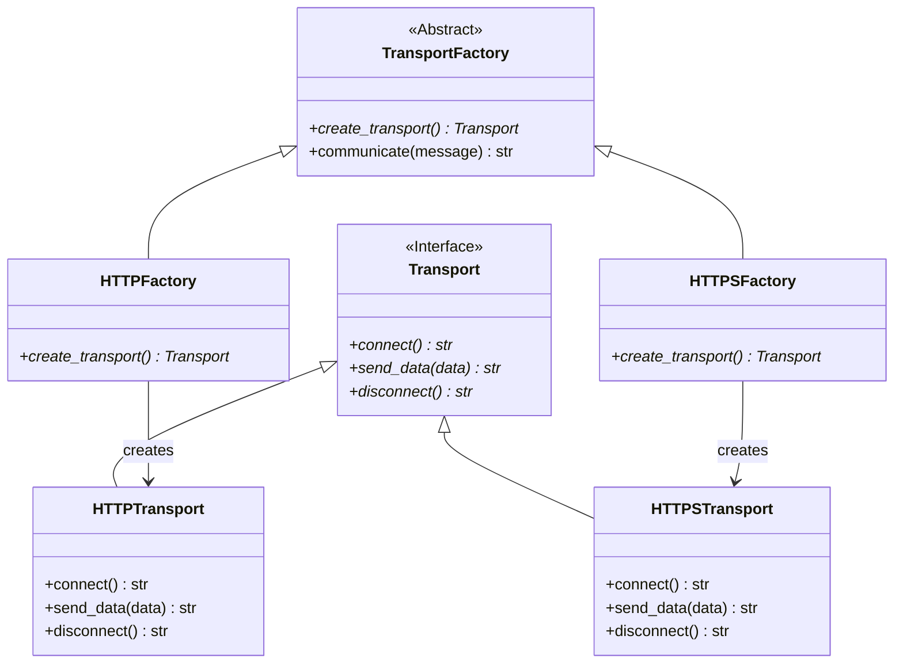
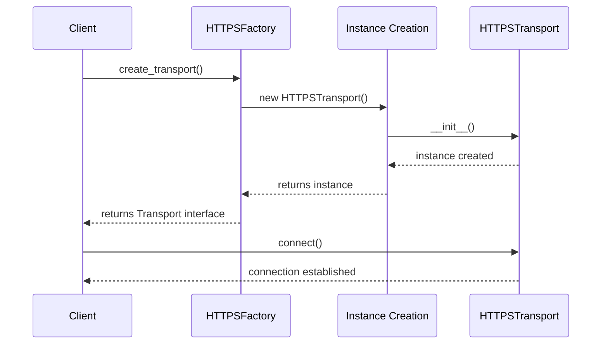

# Factory Method Pattern (Creational)

> **Architectural Level:** Structural  
> **Pythonic Strategy:** Abstract Base Classes & Subclass Polymorphism  
> **Production Status:** Type-Safe | Flexible | Extensively Documented

## Also Known As

- Virtual Constructor
- Polymorphic Factory

## Intent

Define an interface for creating an object, but let subclasses decide which concrete class to instantiate. The Factory Method pattern provides a way to create objects without specifying the exact classes that will be instantiated at compile time, promoting loose coupling between client code and concrete implementations.

## Problem

In many applications, the exact type of object needed depends on runtime conditions or user preferences:

- **Tight Coupling:** Client code directly instantiates concrete classes, creating hard dependencies on specific implementations.
- **Runtime Flexibility:** When the concrete class to be created depends on runtime data or configuration, instantiation logic becomes scattered throughout the codebase.
- **Difficult Extension:** Adding new object types requires modifying client code directly, violating the Open-Closed Principle.
- **Testability:** Hard-coded dependencies make unit testing difficult, as you cannot easily substitute mock objects.
- **Code Duplication:** The same object creation logic may be repeated in multiple places.

**Real-World Scenario:**
Your application supports multiple communication protocols (HTTP, HTTPS, FTP, WebSocket). Each protocol requires different initialization, configuration, and behavior. Without Factory Method, client code would be cluttered with conditional logic:

```python
# Anti-pattern: Hard-coded instantiation
if protocol == "HTTP":
    transport = HTTPTransport()
    transport.init_with_http_settings()
elif protocol == "HTTPS":
    transport = HTTPSTransport()
    transport.init_with_ssl_cert()
elif protocol == "FTP":
    transport = FTPTransport()
    transport.init_with_credentials()
# ...clients scattered across codebase with this logic
```

## Solution

Introduce a **Factory Method** in an abstract creator class. This method returns an object conforming to a common interface (the abstract product). Each concrete creator subclass implements the factory method to produce its specific product type.

### How It Works

1. **Abstract Product:** Defines the common interface for all objects the factory can create.
2. **Concrete Products:** Implement the product interface, each providing specific behavior.
3. **Abstract Creator (Factory):** Declares the factory method (abstract) and may provide template methods that use the factory method.
4. **Concrete Creators:** Override the factory method to create specific product types.

### Architectural Workflow



### Sequence Diagram: Creating Transport via Factory



## Real-World Example

**Content Delivery System:** A content management system needs to save processed images in different formats (JPEG, PNG, WebP). Each format has different:
- Compression algorithms
- Quality settings
- Metadata handling

Without Factory Method, the image processor would contain conditional logic:

```python
# Anti-pattern: Hard-coded format logic
if format == "jpeg":
    processor = JPEGProcessor()
    image = processor.process(raw_image, quality=85)
elif format == "png":
    processor = PNGProcessor()
    image = processor.process(raw_image, compression=9)
# scattered across codebase...
```

With Factory Method:

```python
# Clean: Format-agnostic processing
def save_image(format_type: ImageFormat, image: Image) -> bytes:
    factory = ImageFactoryRegistry.get_factory(format_type)
    processor = factory.create_processor()
    return processor.process(image)
```

**In This Implementation:**
- **Transport types:** HTTP, HTTPS, FTP, WebSocket
- **Concrete Products:** Each implements the `Transport` interface with protocol-specific behavior
- **Factories:** Each creator subclass produces its transport type
- **Registry:** Provides centralized factory management for flexible, runtime-driven creation

## Key Characteristics

### Advantages

- Loose Coupling: Client code depends only on abstractions (interfaces), not concrete classes.
- Single Responsibility: Object creation logic is centralized in one place per type.
- Open/Closed Principle: New product types can be added by creating new factories without modifying client code.
- Polymorphism: All products conform to a common interface, enabling polymorphic behavior.
- Testability: Easy to mock or substitute implementations for unit testing.
- Late Binding: The concrete type is determined at runtime, enabling runtime configuration.

### Disadvantages

- Increased Complexity: Introduces additional classes (one factory per product type) that may feel over-engineered for simple requirements.
- Additional Indirection: Requires navigating through factory indirection rather than direct instantiation.

## Comparison with Other Patterns

### Factory Method vs. Simple Factory

| Aspect | Factory Method | Simple Factory |
|--------|----------------|----------------|
| **Creator** | Abstract class | Single utility class |
| **Extensibility** | Subclass to add new types | Modify the factory class |
| **Complexity** | More classes, follows OCP | Simpler, all logic in one place |
| **Use When** | Multiple related families | Simple, limited type variations |

### Factory Method vs. Abstract Factory

| Aspect | Factory Method | Abstract Factory |
|--------|----------------|-----------------|
| **Focus** | Creating a single family of objects | Creating multiple related families |
| **Number of Factories** | One per product family | One for entire product suite |
| **Relationships** | Single hierarchy | Complex relationships |
| **Use When** | One type of object | Related product suites |

## Implementation Patterns

### Pattern 1: Basic Factory Method (Recommended for Simple Cases)

```python
from abc import ABC, abstractmethod

# Abstract Product
class Database(ABC):
    @abstractmethod
    def connect(self) -> str:
        pass

# Concrete Products
class SQLiteDB(Database):
    def connect(self) -> str:
        return "Connected to SQLite"

class PostgresDB(Database):
    def connect(self) -> str:
        return "Connected to PostgreSQL"

# Abstract Creator
class DatabaseFactory(ABC):
    @abstractmethod
    def create_database(self) -> Database:
        pass

# Concrete Creators
class SQLiteFactory(DatabaseFactory):
    def create_database(self) -> Database:
        return SQLiteDB()

class PostgresFactory(DatabaseFactory):
    def create_database(self) -> Database:
        return PostgresDB()
```

### Pattern 2: Registry-Based Factory (Recommended for Complex Cases)

```python
from enum import Enum
from typing import Dict, Type

class DatabaseType(Enum):
    SQLITE = "sqlite"
    POSTGRES = "postgres"

class DatabaseRegistry:
    """Centralized factory management using a registry."""
    
    def __init__(self):
        self._db_class_map: Dict[DatabaseType, Type[Database]] = {
            DatabaseType.SQLITE: SQLiteDB,
            DatabaseType.POSTGRES: PostgresDB,
        }
    
    def create(self, db_type: DatabaseType) -> Database:
        db_class = self._db_class_map[db_type]
        return db_class()
    
    def register(self, db_type: DatabaseType, db_class: Type[Database]):
        self._db_class_map[db_type] = db_class
```

### Pattern 3: Parametrized Factory Method (For Minimal Hierarchy)

```python
from typing import Type

class TransportFactory:
    """Single factory with parameter-based creation."""
    
    _transport_classes: Dict[str, Type[Transport]] = {
        "http": HTTPTransport,
        "https": HTTPSTransport,
        "ftp": FTPTransport,
    }
    
    @classmethod
    def create_transport(cls, protocol: str) -> Transport:
        transport_class = cls._transport_classes.get(protocol)
        if not transport_class:
            raise ValueError(f"Unknown protocol: {protocol}")
        return transport_class()
```

## Usage Guidelines

### When to Use

- Your application needs to create objects of different types based on runtime conditions.
- You want to decouple client code from specific classes.
- You expect new types will be added over the application's lifetime.
- Single responsibility principle: creation logic is isolated.

### When NOT to Use

- You have only one or two object types that never change.
- The creation logic is trivial (simple constructor calls).
- Your application has a flat hierarchy with no related product families.

## Best Practices

1. **Use inheritance for related types:** Ensure all products implement a common interface.

2. **Minimize factory logic:** Keep factory methods simple; complex initialization should belong to the product.

3. **Use registries for many types:** If supporting many types, consider a registry pattern to avoid factory proliferation.

4. **Type hint for clarity:** Always annotate return types as the product interface, not concrete classes.

5. **Document protocols:** Clearly document the expected behavior and lifecycle of products.

6. **Prefer composition:** If only one factory exists, consider a simpler approach (registry).

## Real-World Applications


## See Also
- [Factory Method Pattern - Wikipedia](https://en.wikipedia.org/wiki/Factory_method_pattern)
- [Abstract Factory Pattern - Wikipedia](https://en.wikipedia.org/wiki/Abstract_factory_pattern)
- [Builder Pattern - Wikipedia](https://en.wikipedia.org/wiki/Builder_pattern)
- [Prototype Pattern - Wikipedia](https://en.wikipedia.org/wiki/Prototype_pattern)
- [Strategy Pattern - Wikipedia](https://en.wikipedia.org/wiki/Strategy_pattern)
- [../abstract_factory/README.md](../abstract_factory/README.md)
- [../builder/README.md](../builder/README.md)
- [../prototype/README.md](../prototype/README.md)
