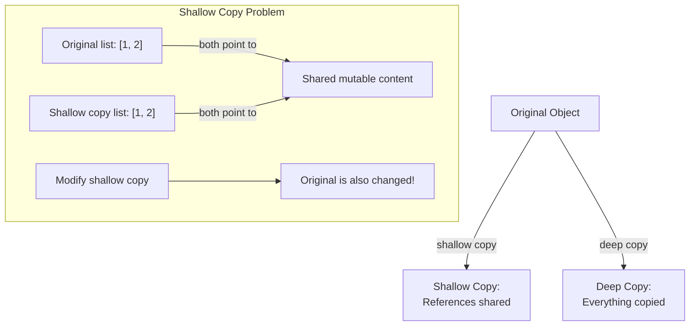
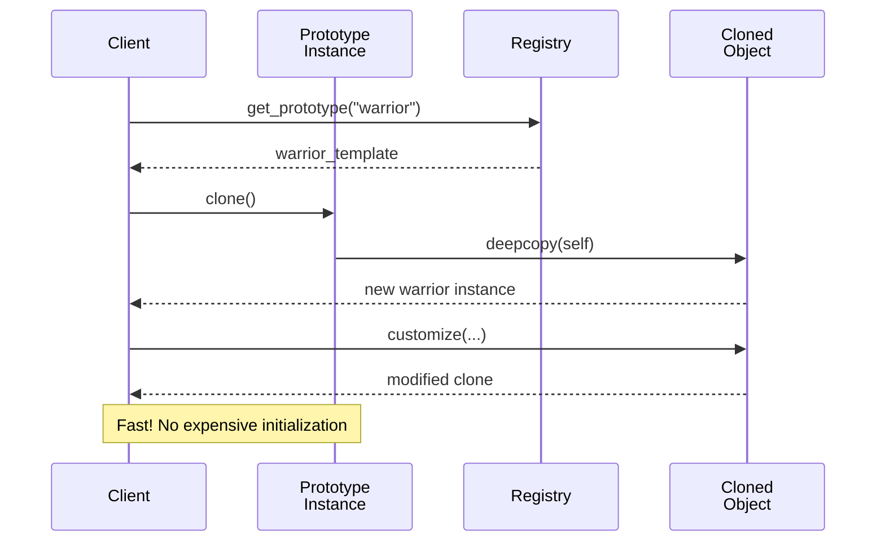

# Prototype Pattern (Creational)

> **Architectural Level:** Object Copying | **Pythonic Strategy:** `copy.deepcopy()` | **Production Status:** Deep Copy Safe | Template-Based
## Also Known As

- Clone
- Copy Constructor

## Intent

Specify the kinds of objects to create using a prototypical instance, and create new objects by copying this prototype. The Prototype pattern enables creating new objects without depending on their specific classes, instead relying on copying existing "prototype" objects.

## Problem

In many applications, creating new objects can be expensive or complex:

- **Expensive Object Creation:** Loading a large data structure from a database, parsing XML/JSON, initializing complex object graphs requires time and resources.

- **Complex Initialization:** Objects with intricate initial states, computed values, or dependencies.

- **Avoiding Class Dependencies:** Coupling client code to concrete classes limits flexibility. You might want to defer which class to instantiate until runtime.

- **Copy Operations Scattered:** Duplication logic spread throughout the codebase, violating DRY principle.

- **Expensive Cloning:** Need to ensure proper deep copying to prevent unintended modifications to shared state.

**Real-World Scenario:**

Creating game characters:

```python
# Anti-pattern: Expensive creation from scratch
def create_warrior():
    character = GameCharacter()
    character.load_stats_from_database()  # Network I/O
    character.initialize_equipment()      # Complex logic
    character.load_skills_from_file()     # File I/O
    character.initialize_animations()     # GPU resource loading
    character.setup_ai_behavior()         # Complex setup
    return character

# Creating 100 warriors this way is unacceptable
warriors = [create_warrior() for _ in range(100)]
```

With Prototype:

```python
# Clean: Clone from a pre-made template
warrior_template = create_warrior()  # Expensive, done once
warriors = [warrior_template.clone() for _ in range(100)]  # Cheap, fast
```

## Solution

Create a prototype object (a fully initialized instance) and use it as a template. When you need a new object, clone the prototype instead of creating from scratch. This shifts the expensive work to a one-time prototype creation, with subsequent creations being fast copies.

### How It Works

1. **Prototype Interface:** Define a `clone()` method that all clonable objects must implement.
2. **Concrete Prototype:** Implement the clone method (typically using `deepcopy` in Python).
3. **Client:** Request new objects by cloning the prototype.
4. **Registry (Optional):** Store and manage multiple prototypes for easy access.

### Comparison: Copy vs. Deep Copy



### Architectural Workflow



## Real-World Example

**Document Management System:** Templates for different document types (reports, memos, letters). Each template is expensive to create (loaded from database with formatting, metadata, etc.). When a user creates a new document, clone the appropriate template rather than initializing from scratch.

```python
# Pre-created templates (expensive, done once)
report_template = load_report_template()      # Expensive
memo_template = load_memo_template()          # Expensive
letter_template = load_letter_template()      # Expensive

# User creates document by cloning template (cheap, fast)
new_report = report_template.clone()          # Cheap!
new_report.title = "Q4 Sales Report"
new_report.save()
```

**In This Implementation:**
- **Document Prototype:** Complex document with sections and metadata
- **GameCharacter Prototype:** Character with skills, equipment, inventory
- **UIComponent Prototype:** UI components with styling and handlers
- **Registry:** Manages prototype collections for easy access

## Key Characteristics

### Advantages

**Performance:** Cloning is faster than complex initialization from scratch.

**Avoiding Class Dependencies:** Create objects without knowing their concrete types.

**Uniform Interface:** All cloneable objects follow the same protocol.

**Runtime Configuration:** Choose prototypes at runtime to create variants.

**Deep Cloning:** Full independence between original and clone (when using `deepcopy`).

**Undo/Redo:** Easy to implement by storing clones of previous states.

**Template Patterns:** Effective for managing multiple templates/variants.

### Disadvantages

**Shallow vs. Deep Copy:** Must be careful with nested mutable objects; shallow copy can cause issues.

**Complexity:** Adds abstraction overhead; overkill for simple objects.

**Circular References:** Can be problematic with complex object graphs.

**Cloning Overhead:** Deep cloning of large objects still has some performance cost.

## Patterns Comparison

### Prototype vs. Builder

| Aspect | Prototype | Builder |
|--------|-----------|---------|
| **Use Case** | Clone existing object | Construct object step-by-step |
| **When Possible** | Object already exists | Need to build from scratch |
| **Initialization** | Copy existing state | Set fields via methods |
| **Complexity** | Simple copy operation | Multiple building steps |

### Prototype vs. Factory Method

| Aspect | Prototype | Factory Method |
|--------|-----------|----------------|
| **Creation** | Copy existing instance | Create new instance |
| **State** | Carries existing state | Uses defaults/parameters |
| **Coupling** | Knows existing prototype | Decouples from concrete types |
| **Performance** | Fast (copy) | Depends on creation logic |

### Shallow Copy vs. Deep Copy (Python)

```python
from copy import copy, deepcopy

# Shallow copy: references are shared
original = Document(sections=[Section("Intro")])
shallow = copy(original)
shallow.sections[0].title = "Modified"
print(original.sections[0].title)  # "Modified" - shared!

# Deep copy: everything is copied
original = Document(sections=[Section("Intro")])
deep = deepcopy(original)
deep.sections[0].title = "Modified"
print(original.sections[0].title)  # "Intro" - independent!
```

## Implementation Patterns

### Pattern 1: Basic Prototype with Deepcopy (Recommended for Python)

```python
from copy import deepcopy

class Prototype:
    def clone(self) -> 'Prototype':
        """Clone using deepcopy."""
        return deepcopy(self)

class GameCharacter(Prototype):
    def __init__(self, name, skills, equipment):
        self.name = name
        self.skills = skills
        self.equipment = equipment

# Usage:
warrior_template = GameCharacter("Warrior", [...], {...})
warrior1 = warrior_template.clone()
warrior1.name = "Conan"  # Doesn't affect template
```

### Pattern 2: Shallow Copy When Appropriate

```python
from copy import copy

class LightweightComponent:
    def clone(self) -> 'LightweightComponent':
        """Clone using shallow copy if immutability is guaranteed."""
        return copy(self)
```

### Pattern 3: Prototype Registry (For Multiple Prototypes)

```python
class PrototypeRegistry:
    def __init__(self):
        self._prototypes = {}
    
    def register(self, name, prototype):
        self._prototypes[name] = prototype
    
    def clone(self, name) -> object:
        prototype = self._prototypes[name]
        return prototype.clone()

# Usage:
registry = PrototypeRegistry()
registry.register("warrior", warrior_template)
new_warrior = registry.clone("warrior")
```

### Pattern 4: Custom Clone Implementation

```python
class Document:
    def clone(self) -> 'Document':
        """Custom cloning with specific logic."""
        cloned = Document(
            title=self.title,
            author=self.author,
            sections=deepcopy(self.sections)
        )
        cloned.created_at = self.created_at  # Don't update timestamp
        cloned.last_modified = datetime.now()
        return cloned
```

## Usage Guidelines

### When to Use

- Object creation is expensive or complex.
- You need to create many similar objects with variations.
- You want to avoid dependency on concrete classes.
- You need to support undo/redo functionality.
- You want to avoid subclass explosion (many variants).
- Runtime configuration of object variants.

### When NOT to Use

- Objects are simple and cheap to create.
- Few instances required (overhead not justified).
- Deep copying of large object graphs is too expensive.
- Prototypes change frequently (defeats the purpose).

## Best Practices

1. **Always Use Deep Copy:** Unless you have a specific reason to share state, use `deepcopy()` to ensure independence.

```python
def clone(self) -> 'Document':
    return deepcopy(self)  # Safest approach
```

2. **Document Clone Behavior:** Clearly specify what is and isn't copied.

```python
def clone(self) -> 'Character':
    """Clone character but generate new ID."""
    cloned = deepcopy(self)
    cloned.id = uuid.uuid4()  # Generate new ID
    cloned.created_at = datetime.now()
    return cloned
```

3. **Use Type Hints:** Specify return type as the concrete class.

```python
class Character(Cloneable):
    def clone(self) -> 'Character':  # Not Cloneable
        return deepcopy(self)
```

4. **Prototype Registry:** Manage multiple prototypes centrally.

```python
registry = PrototypeRegistry()
registry.register("character_warrior", warrior_template)
new_warrior = registry.clone("character_warrior")
```

5. **Immutable After Cloning:** Ensure cloned objects are immediately usable.

6. **Handle Circular References:** Be aware of circular references in complex object graphs.

## Real-World Applications

- **Game Development:** Character templates, item prototypes, level designs.
- **Document Systems:** Document templates (reports, memos, letters).
- **UI Frameworks:** Component templates for rapid UI generation.
- **Configuration Management:** Configuration templates for different environments.
- **Undo/Redo Systems:** Store object snapshots for undo functionality.
- **Database Cloning:** Clone records with relationships.
- **Caching:** Cache prototypes in memory for fast access.

## Real-World Code Examples

### Example 1: Gaming

```python
# Create templates once
warrior = GameCharacter("Warrior", CharacterClass.WARRIOR)
warrior.add_skill(Skill("Slash", 30, 1.5, 10))
warrior.add_skill(Skill("Shield Bash", 20, 2.0, 15))

# Clone for each player
player1_character = warrior.clone()
player1_character.name = "Conan the Barbarian"

player2_character = warrior.clone()
player2_character.name = "Ragnar Lothbrok"
```

### Example 2: Document Management

```python
registry = create_document_templates()
annual_report_template = registry.get("annual_report")

# Create new report from template
new_report = annual_report_template.clone()
new_report.title = "Q1 2025 Report"
new_report.add_section(DocumentSection(...))
```

### Example 3: UI Component Templates

```python
registry = create_ui_component_templates()

# Clone button template for multiple uses
button1 = registry.clone("primary_button")
button1.set_position(10, 10)

button2 = registry.clone("primary_button")
button2.set_position(150, 10)
```

## See Also

- [Prototype Pattern - Wikipedia](https://en.wikipedia.org/wiki/Prototype_pattern)
- [Python copy module documentation](https://docs.python.org/3/library/copy.html)
- [Registry Pattern - Wikipedia](https://en.wikipedia.org/wiki/Registry_pattern)
- [Factory Method Pattern - Wikipedia](https://en.wikipedia.org/wiki/Factory_method_pattern)
- [Abstract Factory Pattern - Wikipedia](https://en.wikipedia.org/wiki/Abstract_factory_pattern)
- [Builder Pattern - Wikipedia](https://en.wikipedia.org/wiki/Builder_pattern)
- [Composite Pattern - Wikipedia](https://en.wikipedia.org/wiki/Composite_pattern)
- [Memento Pattern - Wikipedia](https://en.wikipedia.org/wiki/Memento_pattern)
- [../factory/README.md](../factory/README.md)
- [../abstract_factory/README.md](../abstract_factory/README.md)
- [../builder/README.md](../builder/README.md)
