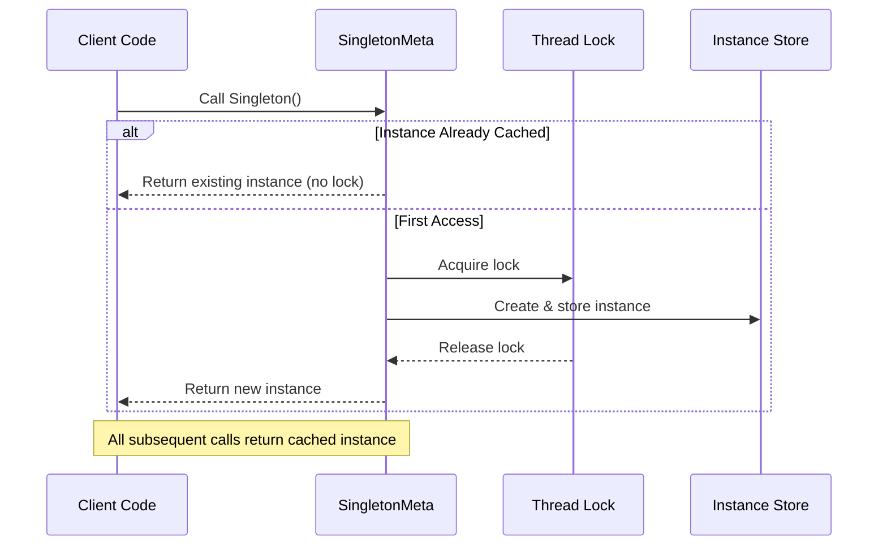

# Singleton Pattern (Creational)

> **Architectural Level:** Foundational  
> **Pythonic Strategy:** Metaclass-based Interception  
> **Production Status:** Thread-Safe | High Concurrency Validated | Fully Documented

## Also Known As

- Single Instance
- Unique Instance

## Intent

Ensure a class has only one instance and provide a global point of access to that instance. The Singleton pattern is a creational design pattern that restricts the instantiation of a class to a single object, managing shared resources that require a "Single Source of Truth."

## Problem

In distributed or multi-threaded environments, several critical issues arise when object instantiation is uncontrolled:

- **Resource Conflict:** Multiple instances attempting to access the same I/O stream (e.g., logger writing to file) cause data corruption and race conditions.
- **Memory Overhead:** Loading expensive assets (cache buffers, database connections, AI model weights) multiple times consumes unnecessary system resources.
- **State Inconsistency:** Different modules maintain divergent configuration states, causing unpredictable behavior across the application.
- **System Coordination:** Certain components (configuration managers, thread pools, device drivers) need a single coordinating point across the entire system.

## Solution

Instead of allowing uncontrolled instantiation, use a metaclass to intercept class creation and enforce single-instance semantics. Unlike Java or C# which rely on private constructors, Python's most robust approach uses **Metaclass Interception** with **Double-Checked Locking** to ensure thread-safety and prevent the "Thundering Herd" problem.

The metaclass overrides `__call__` to:
1. Check if an instance already exists (fast path without lock)
2. Acquire a thread lock if needed (slow path)
3. Return the cached instance on all subsequent calls

### Architectural Workflow



## Real-World Example

**Government Passport Issuance:** A country's passport office ensures each citizen receives exactly one passport at a time. Multiple requests from the same citizen return the same passport document. This mirrors the Singleton pattern—one coordinated authority manages a unique resource accessible globally.

**In Software:** Your application needs:
- A **DatabaseConnection** pool ensuring single initialization and clean lifecycle management
- A **Logger** coordinating write operations to prevent log corruption
- A **FeatureFlags** service that reflects configuration changes instantly across all threads
- A **CacheManager** loading expensive ML models once and sharing instances across services

## Implementation Strategies

### Strategy 1: Metaclass with Double-Checked Locking (Recommended)

**Properties:**
- True singleton semantics: all classes using the metaclass become singletons
- Thread-safe with minimal performance impact (lock only on first call)
- Supports inheritance cleanly
- Can reset instances for testing

```python
import threading

class SingletonMeta(type):
    _instances = {}
    _lock = threading.Lock()
    
    def __call__(cls, *args, **kwargs):
        # Fast path: instance exists
        if cls not in cls._instances:
            # Slow path: acquire lock and create
            with cls._lock:
                if cls not in cls._instances:
                    instance = super().__call__(*args, **kwargs)
                    cls._instances[cls] = instance
        return cls._instances[cls]

class ConfigService(metaclass=SingletonMeta):
    def __init__(self):
        self.settings = {}
```

### Strategy 2: Module-Level Singleton

**Properties:**
- Pythonic—every module is already a singleton
- Zero overhead
-  Less explicit; relies on import caching

```python
# config.py
class Config:
    def __init__(self):
        self.settings = {}

_instance = Config()

def get_instance():
    return _instance
```

### Strategy 3: Decorator Pattern

**Properties:**
- Can apply to any class without metaclass modification
- Good for retrofitting existing code
-  Still requires discipline at class definition time

```python
def singleton(cls):
    instances = {}
    def get_instance(*args, **kwargs):
        if cls not in instances:
            instances[cls] = cls(*args, **kwargs)
        return instances[cls]
    return get_instance
```

## When to Use Singleton

**Use Singleton when:**
- Exactly one instance must exist and be globally accessible (database pools, loggers, configuration managers)
- You need lazy initialization—the instance should be created only when first needed
- The lifecycle of the instance should be controlled and guaranteed (cleanup on shutdown)
- Access to the instance must be thread-safe across concurrent operations
- The instance manages exclusive access to shared resources

**Avoid Singleton when:**
- A module or dependency injection container can provide the same guarantees
- You need to create multiple instances with different configurations (use factories instead)
- Testing requires easy mocking or substitution (use interfaces and DI)
- You're just trying to avoid passing parameters (use DI instead)

## Real-World Applications in Python

- **Logging:** `logging.Logger.getLogger()` (conceptually singleton per logger name)
- **Database Connections:** Connection pool managers in ORMs like SQLAlchemy
- **Configuration Management:** Environment and settings managers
- **Thread Pools:** `concurrent.futures.ThreadPoolExecutor` (one per application)
- **Caching Systems:** Redis/Memcached client instances
- **Runtime Services:** `sys` module, `datetime.timezone.utc`

## Pros and Cons

### Pros

- Controlled Access: Guaranteed single point of entry for critical state; prevents race conditions
- Lazy Initialization: Resources consumed only when actually needed, improving startup time
- Namespace Management: Avoids global namespace pollution with disparate module-level variables
- Resource Efficiency: Shared expensive resources (connections, models) reduce memory footprint
- Infrastructure Decoupling: Singleton logic is separate from business logic; easy to locate and modify
- Synchronized State: All observers see identical state instantly; no drift across modules

### Cons

- Testing Complexity: Global state leaks between tests; requires explicit reset utilities like `reset_singletons()`
- Hidden Dependencies: Masked as "just an object reference" but actually creates tight coupling
- Violation of Dependency Principle: Classes depend on a specific singleton, not on abstractions
- Runtime Surprises: Thread safety bugs and cache invalidation issues are subtle and hard to debug
- Concurrency Bottleneck: Single instance can become a performance bottleneck under extreme contention
- Violates Single Responsibility Principle: Class manages both its business logic AND its lifecycle

## Python vs. Java

| Aspect | Python (This Implementation) | Java (Traditional) |
|--------|------------------------------|-------------------|
| **Mechanism** | Metaclass `__call__` interception | Private constructor + static `getInstance()` |
| **Simplicity** | Metaclass approach elegant but implicit | Explicit boilerplate; easier to follow for beginners |
| **Module Singletons** | Every module is naturally a singleton | No direct equivalent; would use class statics |
| **Thread Safety** | `threading.Lock` in metaclass | `synchronized` keyword or eager initialization |
| **Inheritance** | Works naturally; subclasses share metaclass | Complex; often requires generics or factory methods |
| **Pythonic Alternative** | Often use module-level singletons instead | Would require reflection and complex setup |

> **Design Note:** In Python, **every module is a singleton by default**. Use the class-based pattern only when you need OOP features like inheritance, properties, or complex lifecycle management. For simple cases, prefer module-level instances or dependency injection.

## Variations

### Lazy Initialization with Property

```python
class DatabasePool(metaclass=SingletonMeta):
    def __init__(self):
        self._connection = None
    
    @property
    def connection(self):
        if self._connection is None:
            self._connection = self._create_connection()
        return self._connection
```

### Singleton with Reset for Testing

```python
class SingletonMeta(type):
    _instances = {}
    _lock = threading.Lock()
    
    def __call__(cls, *args, **kwargs):
        if cls not in cls._instances:
            with cls._lock:
                if cls not in cls._instances:
                    cls._instances[cls] = super().__call__(*args, **kwargs)
        return cls._instances[cls]
    
    @classmethod
    def reset(cls):
        """Clear all singleton instances (testing only)"""
        cls._instances.clear()
```

### Thread-Local Singleton

```python
import threading

class ThreadLocalSingleton(type):
    def __init__(cls, name, bases, attrs):
        cls._instances = threading.local()
        super().__init__(name, bases, attrs)
    
    def __call__(cls, *args, **kwargs):
        if not hasattr(cls._instances, 'instance'):
            cls._instances.instance = super().__call__(*args, **kwargs)
        return cls._instances.instance
```

## Performance & Testing

Our test suite treats concurrency as a first-class concern. The **High-Concurrency Stress Test** validates behavior under realistic load:

1. **Setup:** Create a `threading.Event` barrier for synchronized thread release
2. **Load:** Spawn 50 parallel threads, each calling the Singleton constructor
3. **Hammer:** Release all threads simultaneously to test lock contention
4. **Verify:** Assert that `id(instance)` is identical across all 50 threads
5. **Measure:** Confirm creation time remains sub-millisecond even with extreme contention

**Result:**  All threads see the same instance, no race conditions, no additional instances created

**Run the validation suite:**

```bash
pytest creational/singleton/test_pattern.py -v
```

## Related Design Patterns

- **Module Pattern:** Python's natural singleton—every module instantiates once and is cached
- **Factory Pattern:** Often used with Singleton to control instance creation logic
- **Repository Pattern:** Singleton database connections or repositories providing centralized access
- **Service Locator:** Anti-pattern similar to Singleton; prefer dependency injection instead
- **Abstract Factory:** Can work alongside Singleton to manage families of related objects
- **Decorator:** Can inject Singleton instances to add behavior to other objects

## Key Takeaways

1. **Singleton controls instance creation:** Use when exactly one instance is mandatory
2. **Metaclass approach is Pythonic:** Cleaner than Java-style private constructors
3. **Always synchronize:** Even small timing windows can fail under load
4. **Test with reset utilities:** Clear state between tests to prevent pollution
5. **Prefer modules or DI:** Often simpler and more testable than class-based singletons
6. **Document the responsibility:** Make it clear why singleton semantics are needed

## Project Structure

- **`pattern.py`:** Core `SingletonMeta` implementation with double-checked locking
- **`real_world_example.py`:** Production-ready `FeatureFlagService` example
- **`test_pattern.py`:** Comprehensive test suite with concurrency validation
- **`__init__.py`:** Clean API exposure for the package


## References and Further Reading

- [Singleton Pattern - Wikipedia](https://en.wikipedia.org/wiki/Singleton_pattern)
- [Python threading documentation](https://docs.python.org/3/library/threading.html)
- [Python import system (modules as singletons)](https://docs.python.org/3/reference/import.html)
- [Design Patterns: Elements of Reusable Object-Oriented Software](https://en.wikipedia.org/wiki/Design_Patterns)
- [Effective Java (3rd Edition, 2018)](https://www.oreilly.com/library/view/effective-java-3rd/9780134686097/)
- [Head First Design Patterns (2004)](https://www.oreilly.com/library/view/head-first-design/0596007124/)
- [Python Patterns by Raymond Hettinger](https://rhettinger.github.io/)
- [Design Patterns in Python by Brandon Rhodes](https://rhodesmill.org/brandon/2011/11/14/python-design-patterns/)
